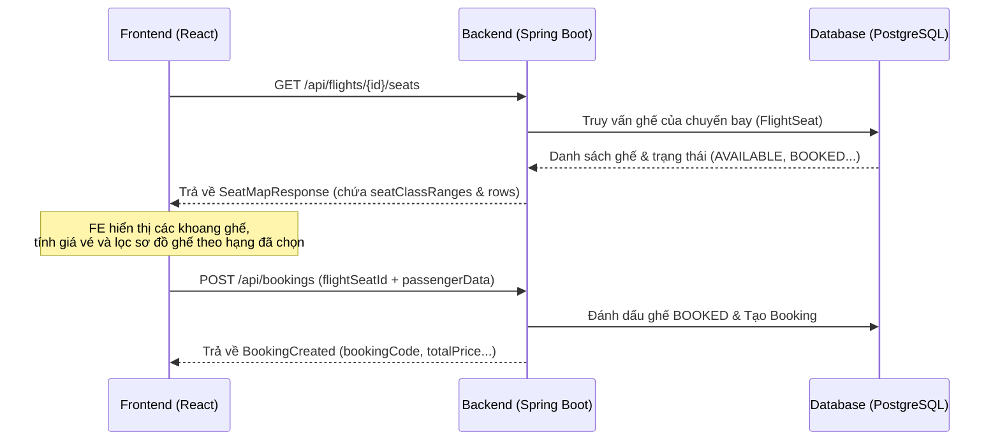

# Hướng Dẫn Tích Hợp API Sơ Đồ Ghế & Đặt Chỗ Cho Khách Hàng (Seat Selection & Booking API Guide)

Tài liệu này hướng dẫn cách frontend sử dụng các API backend để hiển thị sơ đồ ghế của chuyến bay, hiển thị phân hạng ghế theo dải hàng (FIRST, BUSINESS, PREMIUM_ECONOMY, ECONOMY), và tiến hành đặt chỗ (booking).

---

## 1. Luồng Tích Hợp (Workflow)



---

## 2. API Chi Tiết

### 2.1. Lấy Sơ Đồ Ghế Chuyến Bay (GET /api/flights/{flightId}/seats)

API này trả về thông tin cấu tạo các hạng ghế (dải hàng, giá vé, số ghế trống còn lại) kèm theo sơ đồ chi tiết từng ghế để vẽ cabin tàu bay.

* **URL**: `/api/flights/{flightId}/seats`
* **Method**: `GET`
* **Headers**: `Authorization: Bearer <JWT_ACCESS_TOKEN>`
* **Response Body**:
  ```json
  {
    "success": true,
    "message": "Seat map retrieved successfully",
    "data": {
      "flightId": 1,
      "aircraft": "A350-900",
      "seatClassRanges": [
        {
          "className": "FIRST",
          "label": "Hạng nhất – suite riêng tư",
          "rowStart": 1,
          "rowEnd": 1,
          "price": 2250000.00,
          "totalSeats": 2,
          "availableSeats": 2
        },
        {
          "className": "BUSINESS",
          "label": "Hạng thương gia – ghế rộng, ưu tiên",
          "rowStart": 2,
          "rowEnd": 2,
          "price": 1350000.00,
          "totalSeats": 4,
          "availableSeats": 4
        },
        {
          "className": "ECONOMY",
          "label": "Hạng phổ thông – tiêu chuẩn",
          "rowStart": 20,
          "rowEnd": 21,
          "price": 900000.00,
          "totalSeats": 12,
          "availableSeats": 10
        }
      ],
      "rows": [
        {
          "rowNumber": 1,
          "seats": [
            {
              "flightSeatId": 1,
              "seatNumber": "1A",
              "seatClass": "FIRST",
              "status": "AVAILABLE",
              "price": 2250000.00
            },
            {
              "flightSeatId": 2,
              "seatNumber": "1B",
              "seatClass": "FIRST",
              "status": "AVAILABLE",
              "price": 2250000.00
            }
          ]
        },
        {
          "rowNumber": 2,
          "seats": [
            {
              "flightSeatId": 3,
              "seatNumber": "2A",
              "seatClass": "BUSINESS",
              "status": "BOOKED",
              "price": 1350000.00
            }
            // ...
          ]
        }
      ]
    }
  }
  ```

---

### 2.2. Tạo Đặt Vé Chuyến Bay (POST /api/bookings)

API này dùng để tạo thông tin đặt chỗ sau khi khách hàng đã chọn xong ghế và nhập đầy đủ thông tin hành khách.

* **URL**: `/api/bookings`
* **Method**: `POST`
* **Headers**: 
  - `Content-Type: application/json`
  - `Authorization: Bearer <JWT_ACCESS_TOKEN>`
* **Request Body**:
  ```json
  {
    "flightId": 1,
    "contactName": "Nguyen Van A",
    "contactEmail": "nguyenvana@gmail.com",
    "contactPhone": "0901234567",
    "passengers": [
      {
        "flightSeatId": 1,
        "passengerData": {
          "fullName": "Nguyen Van A",
          "gender": "MALE",
          "dateOfBirth": "1995-10-15",
          "passportNumber": "B12345678",
          "nationality": "VN"
        }
      }
    ]
  }
  ```
* **Response Body**:
  ```json
  {
    "success": true,
    "message": "Booking created successfully",
    "data": {
      "bookingId": 12,
      "bookingCode": "BK1716260840",
      "flightId": 1,
      "totalPrice": 2250000.00,
      "status": "PENDING_PAYMENT",
      "bookingDate": "2026-05-21T12:00:00"
    }
  }
  ```

---

## 3. TypeScript Interfaces Tham Khảo cho FE

```typescript
// Đại diện cho từng ghế đơn lẻ
export interface SeatItem {
    flightSeatId: number;
    seatNumber: string;
    seatClass: 'ECONOMY' | 'BUSINESS' | 'FIRST' | 'PREMIUM_ECONOMY';
    status: 'AVAILABLE' | 'BOOKED';
    price: number;
}

// Cấu trúc phân chia hạng ghế nhận từ BE
export interface SeatClassRange {
    className: string;
    label: string;
    rowStart: number;
    rowEnd: number;
    price: number;
    totalSeats: number;
    availableSeats: number;
}

// Response đầy đủ từ API sơ đồ ghế
export interface FlightSeatsMapResponse {
    flightId: number;
    aircraft: string;
    seatClassRanges: SeatClassRange[];
    seats: SeatItem[];
}

// Payload gửi lên khi tạo booking
export interface CreateBookingPayload {
    flightId: number;
    contactName: string;
    contactEmail: string;
    contactPhone: string;
    passengers: Array<{
        flightSeatId: number;
        passengerData: {
            fullName: string;
            gender: 'MALE' | 'FEMALE';
            dateOfBirth: string;
            passportNumber: string;
            nationality: string;
        };
    }>;
}
```

---

## 4. Hướng Dẫn Render trên Frontend

1. **Hiển thị Tóm Tắt Hạng Ghế**: 
   Dùng `seatClassRanges` thu được để hiển thị danh sách các hạng ghế cùng thông tin khoảng hàng (ví dụ: `Hàng: 1 - 4`), giá tiền riêng biệt, và tổng số ghế trống còn lại của khoang đó.
2. **Lọc Sơ đồ Ghế**: 
   Khi người dùng đang chọn hạng ghế nào (ví dụ: `BUSINESS`), FE thực hiện lọc danh sách các hàng ghế thuộc dải hàng của hạng đó (`rowNumber` nằm trong khoảng `[rowStart, rowEnd]`) để vẽ cabin tương ứng.
3. **Màu sắc Trạng thái**:
   - `status === 'AVAILABLE'`: Hiển thị màu xanh lá cây hoặc xám nhạt (Cho phép click chọn).
   - `status === 'BOOKED'`: Hiển thị màu xám đậm hoặc đỏ gạch (disabled, không cho phép click).
   - Ghế đang được người dùng nhấn chọn: Hiển thị viền màu đỏ đậm hoặc xanh dương nổi bật.
